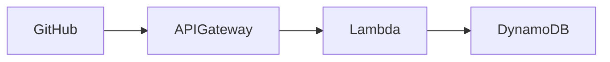
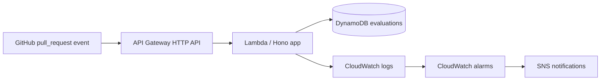

<!-- markdownlint-disable-file -->

# Research: Slidev Documentation and Diagram Artifacts

## Task Summary

Create a Slidev-based review deck under `diagrams/`, add a short written design rationale, and update the repository documentation so the challenge's communication deliverables are easy for reviewers to find and run.

## Tool Usage and Verified Findings

### Workspace discovery

- `list_dir` on `.copilot-tracking/research/` confirmed there was no existing research file for Slidev, diagrams, or documentation-deliverable work.
- `list_dir` on `/Users/admin/dev/cvs-challenge/diagrams` failed with `ENOENT`, which confirms the repository does not currently have a `diagrams/` directory.
- `read_file` on `package.json` confirmed the repo currently exposes only application build and test scripts. It has no Slidev dependency, no slides-related script, and no documentation build path.
- `read_file` on `README.md` confirmed the main README is focused on deployment, runtime behavior, environment variables, and OpenTofu operations. It does not currently include a dedicated 1–2 paragraph design rationale section and it does not link to any diagram or slide artifact.
- `read_file` on `docs/requirements.md` confirmed the challenge explicitly asks for:
  - a README plus deployment explanation
  - a short design rationale that explains a key design decision and alternatives considered
  - a technical diagram using Mermaid, PlantUML, draw.io, or similar
  - committed diagram artifacts in a `diagrams/` directory
- `read_file` on `docs/build-by-stages.md` confirmed the repository's own planning docs already reserve `diagrams/` for architecture artifacts and call out docs plus diagram work as a distinct delivery stage.
- `read_file` on `docs/multiagent-stage-briefs.md` confirmed the docs-and-diagram workstream is expected to update architecture documentation and add or update the diagram in `diagrams/`.
- `read_file` on `AGENTS.md` confirmed repository guidance expects docs to stay honest, new commands to be documented, and file changes to track the real implementation rather than aspirational notes.

### Current project facts the deliverables should represent

- `README.md` and `docs/project-overview.md` agree on the core platform story: PR Concierge receives GitHub pull request webhooks, validates signatures, fetches changed files, applies deterministic checks, scores risk, persists results, and exposes `GET /health` plus `POST /webhooks/github`.
- `README.md` confirms the production AWS footprint already includes API Gateway HTTP API, Lambda, DynamoDB, optional S3 raw-event archiving, CloudWatch logging and alarms, and SNS notifications.
- `README.md`, `infra/terraform/README.md`, and `AGENTS.md` confirm the supported infrastructure path is OpenTofu driven by Bash scripts in `scripts/`, not ad hoc AWS console steps.
- `.github/workflows/deploy.yml` confirms the deployment story reviewers should see in docs includes Node build/test, OpenTofu format/init/validate, AWS OIDC authentication, backend bootstrap, stack deployment, smoke tests, and deployed integration checks.
- `docs/project-overview.md` already records useful architecture and tradeoff facts that can feed the final documentation artifacts, including Lambda over ECS, DynamoDB over RDS, and deterministic rules before AI embellishment.

### Current gaps relative to the challenge requirement

- There is no `diagrams/` directory yet.
- There is no Slidev entry file in the repo.
- There is no dedicated `DECISIONS.md` file.
- The README does not currently point reviewers to a rationale document or slide deck.
- The package manifest does not provide a standard way to preview or build presentation artifacts.

## External Research: Slidev Deck Structure and Diagram Support

### Slidev deck structure

From the official Slidev syntax guide and the local Slidev skill references:

- the first YAML frontmatter block configures the whole deck
- `---` separates slides
- HTML comments at the end of a slide become presenter notes
- Slidev accepts an explicit entry path, so the deck can live anywhere in the repository, including `diagrams/`

Minimal example:

```md
---
theme: default
title: PR Concierge Architecture Review
---

# PR Concierge

Short intro.

---

# Architecture



<!--
Talk track for the architecture slide.
-->
```

That syntax matches the repo's need for a simple, text-based source artifact that can live in version control and be reviewed like any other Markdown file.

### Mermaid and PlantUML support

From the official Slidev Mermaid and syntax docs plus the local Slidev skill references:

- Mermaid diagrams render directly from fenced `mermaid` blocks
- PlantUML diagrams render directly from fenced `plantuml` blocks
- PlantUML uses `https://www.plantuml.com/plantuml` by default unless the deck overrides `plantUmlServer`

Mermaid example:

```md

```

For this repository, Mermaid is the best fit because the current architecture is event-driven, the syntax is concise, and the raw diagram source can live inline in the Slidev deck inside `diagrams/`.

### CLI workflow and export implications

From the official Slidev CLI and exporting docs plus the local Slidev skill references:

- local preview uses `slidev [entry]`
- static build uses `slidev build [entry]`
- export uses `slidev export [entry]`
- PDF, PNG, or PPTX export requires Playwright or Chromium support, while normal deck preview/build does not

Practical implication for this repo:

- if the requirement is only to commit the slides and their raw diagram source, the implementation can stay lighter by adding Slidev preview/build support first
- if the repository later wants a committed PDF or PNG, the implementation can add an export dependency in a follow-up or in the same change if the user explicitly wants a rendered artifact

Suggested script shape:

```json
{
  "scripts": {
    "slides:dev": "slidev diagrams/pr-concierge-architecture.slidev.md",
    "slides:build": "slidev build diagrams/pr-concierge-architecture.slidev.md"
  }
}
```

## Evidence-Backed Recommendations for This Repository

### 1. Use a dedicated `DECISIONS.md` file for the short rationale

The current README is already long and operations-heavy. A separate `DECISIONS.md` keeps the rationale easy to review without burying deployment instructions. The README should still link to it so the artifact is discoverable from the repo's front door.

Recommended rationale topic:

- explain why the service uses API Gateway plus Lambda instead of ECS Fargate for the MVP
- mention the alternatives considered, such as ECS Fargate or a larger service footprint
- tie the decision back to challenge constraints: small scope, fast delivery, low operations overhead, and clear demoability

### 2. Put the primary Slidev deck directly in `diagrams/`

Recommended deck path:

- `diagrams/pr-concierge-architecture.slidev.md`

Why this path fits the repo:

- it satisfies the challenge requirement that the diagram artifact lives in `diagrams/`
- it keeps the editable raw diagram source in the same tracked file because Mermaid is plain text inside the deck
- it avoids inventing a second docs tree for presentation content

### 3. Keep the deck focused on reviewer questions, not just visuals

The best deck for this repo should do more than show one picture. It should help a reviewer understand the system in a few minutes.

Recommended slide sequence:

1. Cover and challenge framing
2. What PR Concierge does for developers and platform engineers
3. Architecture diagram slide with Mermaid
4. Request flow or deployment workflow slide
5. Observability and operational maturity slide
6. Design decision summary slide that points to `DECISIONS.md`
7. Demo path or next-steps slide

That sequence matches the repo's documented architecture, the challenge's communication requirements, and the existing docs emphasis on deployment, observability, and scoped MVP decisions.

### 4. Update `README.md` for navigation and local usage

The README should gain a small documentation section that links to:

- `DECISIONS.md`
- the Slidev deck in `diagrams/`
- the local preview/build commands if Slidev scripts are added

This keeps the new artifacts discoverable without duplicating their full content.

### 5. Prefer Mermaid over PlantUML for the first implementation pass

Both are supported, but Mermaid is the lower-friction choice here because:

- the repo already leans on Markdown-heavy docs
- the architecture is straightforward enough for Mermaid flowcharts
- Mermaid avoids any PlantUML server customization discussion unless the team later wants UML-specific notation

## Recommended Implementation Guidance

1. Create `DECISIONS.md` with one short rationale section focused on a real architectural tradeoff already reflected in the implementation.
2. Create `diagrams/pr-concierge-architecture.slidev.md` as the committed Slidev entry file.
3. Embed the architecture diagram as a Mermaid block directly in the deck so the raw diagram source lives inside `diagrams/`.
4. Add Slidev support in `package.json` and `package-lock.json` with at least local preview and static build commands.
5. Update `README.md` to link to the new rationale and deck artifacts and explain how to preview them locally.
6. Keep export optional unless the user explicitly wants committed PDF, PNG, or PPTX output, because export adds extra runtime dependencies that the current requirement does not strictly need.

## External References

- `https://sli.dev/guide/syntax.html` - Official Slidev syntax guide for headmatter, slide separators, and notes
- `https://sli.dev/features/mermaid.html` - Official Mermaid support in Slidev
- `https://sli.dev/guide/exporting` - Official Slidev export behavior and dependency implications
- `.agents/skills/slidev/SKILL.md` - Repo-local Slidev workflow summary and command references
- `.agents/skills/slidev/references/core-cli.md` - Repo-local CLI reference for preview/build/export commands
- `.agents/skills/slidev/references/core-syntax.md` - Repo-local syntax reference for deck structure
- `.agents/skills/slidev/references/diagram-mermaid.md` - Repo-local Mermaid syntax reference