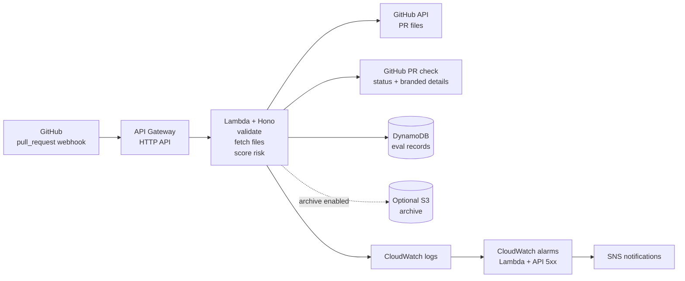

<!-- markdownlint-disable-file -->

---
layout: cover
class: cover-slide
zoom: 0.88
---

Platform engineering challenge

<h1 class="hero-title">PR Concierge</h1>

  A webhook-driven service that turns pull request activity into a fast, explainable risk signal, stores the evaluation, and writes a branded PR check — with an AWS footprint small enough to review in one sitting.

Hono + Lambda
OpenTofu-managed AWS
Deterministic rules first

Architecture stance

<h2>Keep the request path short and the ops story obvious.</h2>

  The design favors burst-friendly compute, readable infrastructure, and clear reviewer talking points over a larger always-on platform shape.

Ingress

GitHub → API Gateway → Lambda

A clean event path for short-lived webhook work.

Persistence + feedback

DynamoDB record + PR check

Each evaluation leaves one durable record and one reviewer-visible check result.

Operations

Logs, alarms, and SNS by default

Operational awareness is built in, not promised later.

<!--
This is the fast reviewer tour. The goal is to explain the architecture that exists today, not the roadmap version. I would open by saying the service handles GitHub pull request webhooks, applies deterministic checks, stores the evaluation, and keeps the infrastructure simple enough to reason about in an interview.
-->

---
class: product-slide
zoom: 0.9
---

<h1>What the service does</h1>

  One inbound webhook becomes one fast platform signal: verify the request, inspect the pull request, score risk, save the evaluation, and publish a PR check that a human can act on.

Receive

<h3>Accept GitHub pull request events</h3>

The HTTP surface stays deliberately small: <code>GET /health</code> and <code>POST /webhooks/github</code>.

Verify

<h3>Reject bad or unsigned requests early</h3>

Webhook signature validation happens before the service spends time on GitHub API work.

Analyze

<h3>Apply deterministic checks and risk rules</h3>

Branch naming, optional labels, and changed-file risk scoring are explainable and easy to test.

Persist

<h3>Store the evaluation and update the PR check</h3>

The deployed runtime writes the DynamoDB record, emits structured logs, and finishes the branded <code>pr-concierge</code> check.

AI posture

AI helps build the repo, but the runtime decision path stays deterministic.

Archive posture

Raw event archiving is optional and still intentionally incomplete today.

Test posture

The default deployed suite proves the safe paths first and opts into live success cases later.

<!--
This slide reframes the plain bullet list into a product-surface view. I would narrate it as a clean four-step contract: receive, verify, analyze, then persist and publish. The smaller cards at the bottom show scope discipline instead of trying to hide what the MVP intentionally does not do yet.
-->

---
class: architecture-slide
zoom: 0.88
---

<h1>Architecture at a glance</h1>

  The runtime path stays short. Reviewer feedback, storage, and operational telemetry branch cleanly from the Lambda handler instead of hiding inside later follow-up work.

<!--
  This stays as the anchor diagram slide. I would narrate the primary request path from left to right, then call out the storage branch, the optional archive branch, and the observability branch. The surrounding detail now lives on the later slides so this one can breathe visually.
-->

---
layout: two-cols
class: flow-slide
zoom: 0.88
---

<h1>Request flow and delivery path</h1>

  The runtime behavior and the operator workflow are both explicit. That keeps the interview story crisp and the repo easy to navigate.

Runtime flow

<ol class="number-list">
<li><strong>Receive and verify</strong>The request enters through <code>POST /webhooks/github</code>, and signature checking rejects bad inputs before deeper processing.</li>
<li><strong>Fetch and classify</strong>The service reads changed files, applies deterministic rules, and derives a risk level.</li>
<li><strong>Persist, publish, and respond</strong>The service stores the evaluation, updates the <code>pr-concierge</code> check, and leaves structured logs behind for operators.</li>
</ol>

::right::

Delivery flow

<ol class="number-list">
<li><strong>Verify locally</strong><code>npm run test</code> proves the Lambda handler and local integration path.</li>
<li><strong>Deploy through CI</strong><code>.github/workflows/deploy.yml</code> builds, tests, validates OpenTofu, and deploys.</li>
<li><strong>Opt into self-dogfooding</strong><code>scripts/configure-self-webhook.sh</code> is the explicit step that turns this repo into its own webhook source.</li>
</ol>

<!--
I would use this slide to connect application behavior to operator behavior. The left side is the runtime sequence. The right side is the ship-and-dogfood sequence. That gives the reviewer a clean mental model for both coding and deployment questions.
-->

---
class: ops-slide
zoom: 0.9
---

<h1>Observability and scope control</h1>

  Modern decks look cleaner when each slide makes one argument. This one is simple: the MVP is operationally aware, but it refuses to fake completeness.

Already implemented

Logging

<h3>Structured JSON output</h3>

Request and evaluation context are available without hunting through plain text logs.

Alarming

<h3>CloudWatch metric alarms</h3>

The deployed stack watches Lambda errors and API Gateway 5xx signals.

GitHub feedback

<h3>Reviewer-visible check runs</h3>

Each supported event creates or updates the <code>pr-concierge</code> check with status, summary, and branded details.

Verification

<h3>Local and deployed test paths</h3>

The repo proves health checks, invalid requests, and live paths separately and honestly.

Intentionally deferred

<ul class="clean-list">
<li><strong>Full raw event archiving</strong>S3 exists as an option, but the payload write path is not oversold as complete.</li>
<li><strong>Runtime AI summaries</strong>AI wording can come later; the MVP keeps the decision engine deterministic now.</li>
<li><strong>Always-on container runtime</strong>ECS Fargate stays an alternative, not default complexity.</li>
</ul>

<!--
This is the engineering-judgment slide. I would explain that the repo already proves logging, alarms, GitHub feedback, and verification paths, then use the deferred column to show that the scope stayed honest instead of drifting into a half-built platform.
-->

---
layout: two-cols
class: decision-slide
zoom: 0.92
---

<h1>Key design decision</h1>

  API Gateway plus Lambda is the MVP shape because it keeps the product, deployment, and demo path aligned around one bursty request model that stores an evaluation and updates the PR in the same pass.

Chosen for the MVP

<h2>API Gateway + Lambda</h2>
<ul class="clean-list">
<li><strong>Right-sized for webhook traffic</strong>The service wakes up for short-lived work instead of paying for idle containers.</li>
<li><strong>Faster to explain and review</strong>The AWS footprint stays small enough for a technical interviewer to reason about quickly.</li>
<li><strong>Easy to evolve later</strong>If the workload changes, the boundary around request handling is still clear enough to migrate.</li>
</ul>

::right::

Alternatives considered

<ul class="clean-list">
<li><strong>ECS Fargate</strong>Better for longer-lived runtime control, but heavier than the current traffic pattern needs.</li>
<li><strong>Broader multi-service footprint</strong>Would add delivery surface area before the webhook workflow itself had earned it.</li>
</ul>

Read next

  The full prose version of this tradeoff lives in <code>DECISIONS.md</code>, so the reviewer can switch from visual summary to rationale without leaving the repo.

<!--
This remains the anchor tradeoff slide, just in a more review-friendly layout. I would say Lambda is not universally better; it is simply the best fit for the repo's current scale, request pattern, and challenge scope.
-->

---
layout: center
class: final-slide
---

Reviewer demo path

<h1 class="hero-title hero-title--compact">Show the system in four beats</h1>

  Start with the smallest proof, then step outward into persistence, logs, and infrastructure.

01

<h3>Health check</h3>

Show <code>GET /health</code> first to prove the runtime surface is alive.

02

<h3>Signed webhook</h3>

Send a realistic pull request event through the verified webhook path.

03

<h3>Saved evaluation + PR check</h3>

Inspect the DynamoDB record and the branded <code>pr-concierge</code> check details on the pull request.

04

<h3>Ops signals</h3>

Close on logs, alarms, and deploy artifacts to prove operational maturity.

<!--
I would close by turning the deck into an interview map. The reviewer can follow the health check, webhook handling, persistence, and operational signals in a short walkthrough, then jump into the code or OpenTofu modules for any area they want to inspect in more depth.
-->